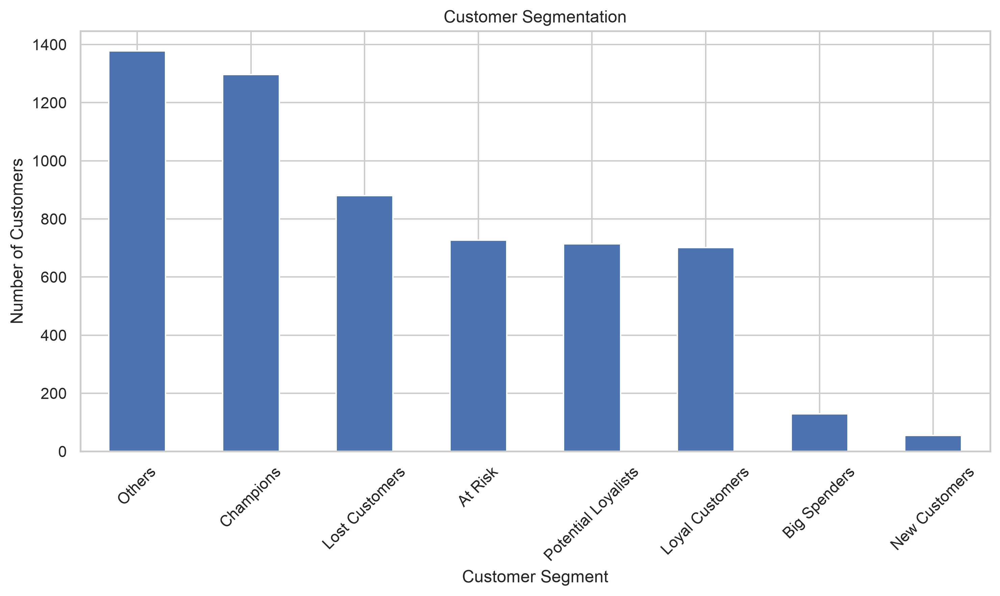
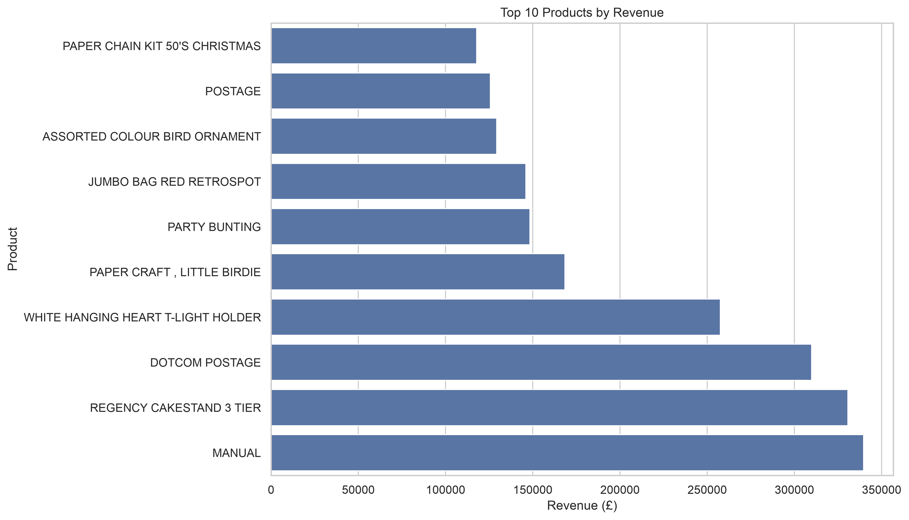
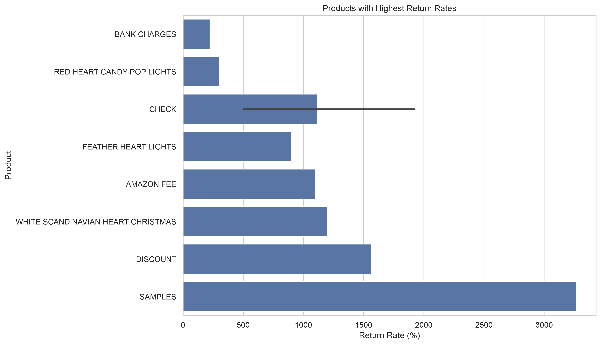
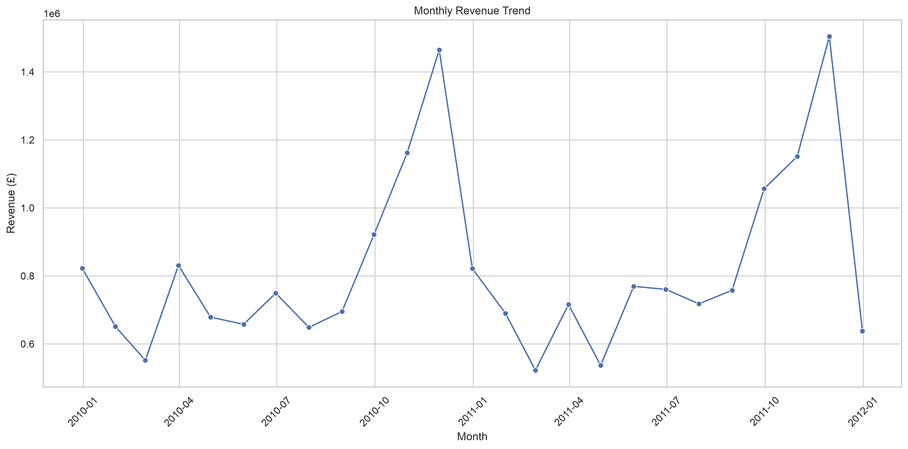
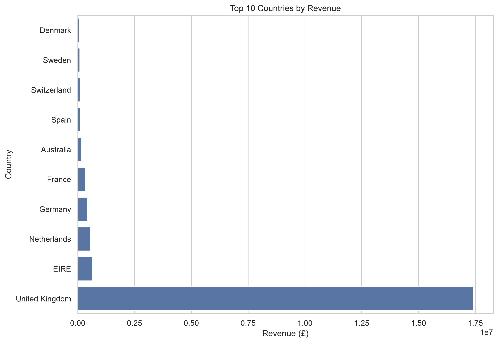

# E-Commerce Life-Cycle Analysis

## Executive Summary

### Project Objective

This project analyzes the Online Retail II transaction dataset from a UK-based online retailer covering 2009–2011.

The objective was to transform a raw and imperfect transactional dataset into a clean analytical dataset and use it to understand sales performance, customer behavior, product performance, returns, customer retention, and purchasing patterns.

The analysis covered the complete analytical lifecycle:

- Data understanding
- Data quality assessment
- Data cleaning
- Exploratory data analysis
- Customer segmentation
- RFM analysis
- Cohort analysis
- Product and country analysis
- Return analysis
- Basket analysis
- Association-rule mining
- Business communication

---

# 1. Dataset Overview

The original dataset contains approximately 1 million transaction records.

Key data-quality issues included:

- Missing Customer IDs
- Duplicate transactions
- Negative quantities representing returns
- Zero and anomalous prices
- Inconsistent product descriptions
- Cancelled invoices
- Different transaction patterns across countries

These issues were explicitly investigated and documented rather than simply removed.

---

# 2. Key Business Metrics

| Metric | Value |
|---|---:|
| Total Revenue | £... |
| Total Orders | ... |
| Total Customers | ... |
| Total Products | ... |
| Total Countries | ... |
| Average Order Value | £... |
| Return Rate | ...% |

---

# 3. Key Insight 1 — Revenue Concentration

A relatively small proportion of products accounts for a large proportion of total revenue.

The Pareto analysis showed that approximately **X% of products generated 80% of revenue**.

### Business implication

The company should closely monitor high-revenue products because inventory availability, pricing, and customer demand for these products can disproportionately affect overall revenue.

---

# 4. Key Insight 2 — Customer Segmentation

RFM analysis revealed distinct customer groups based on:

- Recency
- Frequency
- Monetary value

The segmentation highlights high-value customers as well as customers who may be at risk of becoming inactive.

### Business implication

Customer-specific strategies can be applied instead of treating the entire customer base identically.

For example:

- High-value customers → loyalty and retention campaigns
- Recent customers → conversion into repeat buyers
- At-risk customers → reactivation campaigns
- Low-value/inactive customers → lower-cost marketing

---

# 5. Key Insight 3 — Product and Return Performance

Revenue leaders and volume leaders are not necessarily the same products.

The analysis also identified products with unusually high return rates.

### Business implication

Product decisions should consider both sales performance and return behavior.

A high-revenue product with a high return rate may require investigation into:

- Product quality
- Product descriptions
- Customer expectations
- Pricing
- Packaging
- Fulfillment

---

# 6. Sales Trend

Revenue was analyzed across months, days of the week, and hours of the day.

The time-series analysis revealed seasonal changes in purchasing behavior.

### Business implication

The company can use historical seasonality to improve:

- Inventory planning
- Staffing
- Marketing campaigns
- Promotional timing
- Stock replenishment

---

# 7. Geographic Performance

The UK represented the dominant market, while other countries contributed varying levels of revenue, order volume, and customer activity.

Country-level AOV and return rates were also compared.

### Business implication

Geographic expansion decisions should consider not only total revenue but also:

- Customer count
- Order frequency
- Average order value
- Return behavior

---

# 8. Basket Analysis

Association-rule mining was used to identify products frequently purchased together.

The analysis considered:

- Support
- Confidence
- Lift

High-lift associations can be used to identify potential cross-selling opportunities.

### Business implication

Association rules could support:

- Product recommendations
- Frequently-bought-together sections
- Bundle creation
- Cross-selling campaigns
- Personalized email recommendations

---

# 9. Recommendations

Based on the analysis, the following actions are recommended:

### 1. Protect high-value products

Prioritize inventory availability and monitoring for products responsible for a significant share of revenue.

### 2. Target customer segments

Use RFM segments to develop differentiated retention and reactivation campaigns.

### 3. Investigate high-return products

Prioritize products with both high revenue and high return rates for operational investigation.

### 4. Use product associations

Use high-confidence and high-lift association rules to create cross-selling and recommendation strategies.

### 5. Use seasonality for planning

Align inventory and marketing activities with historical purchasing patterns.

---

# 10. Limitations

Several limitations should be considered.

- The dataset does not contain product cost information, so profitability cannot be calculated.
- Missing Customer IDs limit customer-level analysis for some transactions.
- Association rules identify statistical relationships and do not necessarily establish causality.
- Historical purchasing behavior may not represent current customer behavior.
- Return interpretation depends on how cancellations and negative quantities are represented in the source data.

---

# Conclusion

This project demonstrates a complete data-analysis lifecycle from raw transactional data to business recommendations.

Rather than treating preprocessing as a minor step, the project explicitly investigated data-quality problems and quantified the impact of cleaning decisions.

The resulting analysis provides insights into:

- Revenue performance
- Customer value
- Customer retention
- Product concentration
- Geographic performance
- Returns
- Cross-selling opportunities

The final Streamlit dashboard provides an interactive interface for exploring these findings.